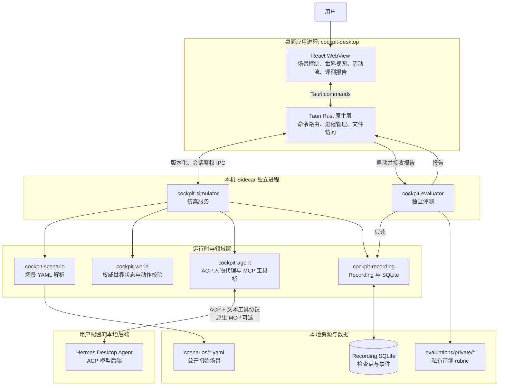
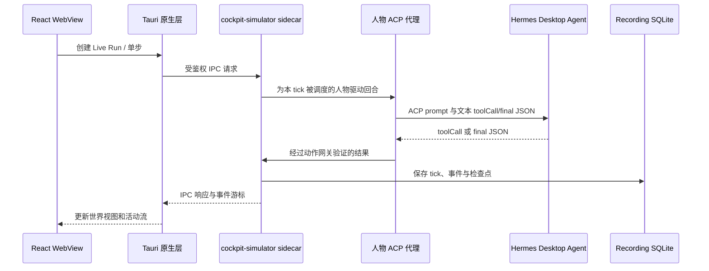

# Cockpit Desktop 分层架构与 Sidecar

## 一句话说明

**Sidecar（伴随进程）**是由 Cockpit Desktop 原生层启动并管理的独立本地可执行程序。它不是浏览器插件、云服务，也不是另一个桌面窗口。它将模拟运行和独立评测从 WebView 与桌面进程中隔离出来；Desktop 通过本机受鉴权的 IPC 与它通信。

## 分层架构图



## Sidecar 分工

| 进程 | 何时启动 | 职责 | 可访问的数据 |
| --- | --- | --- | --- |
| `cockpit-simulator` | Desktop 创建或恢复仿真时 | 载入场景、维护权威世界状态、执行动作校验、驱动 Live ACP 人物回合、保存 Recording | 公开场景、模拟状态、Recording SQLite；**不读取私有 rubric** |
| `cockpit-evaluator` | 用户请求评测时 | 只读 Recording，按私有 rubric 生成 `pass`、`fail` 或 `inconclusive` 报告 | Recording、私有 rubric；**不修改仿真世界** |

`cockpit-simulator` 是仿真的 Ground Truth 所有者。前端展示状态和发送命令，但不直接修改世界。`cockpit-evaluator` 则是独立评测平面，避免运行中的模拟进程既执行又给自己评分。

## 一次 Live 运行的数据流



## Live 运行的超时与后端预热

Live 运行按事件驱动真实后端（Hermes via iota-core ACP）回合：首次任务、紧急感知、显式唤醒、恢复和未完成计划立即调用；连续的常规传感器变化会合并，安静人物最多每 3 个 tick 复查一次。回合本身有耗时（冷启动、模型推理、多轮工具调用），因此各层的超时预算必须自上而下保持一致，否则会出现"某一层提前掐断连接"导致的伪超时。下面几条是排查 Live 运行超时问题时需要牢记的不变量。

### 1. 桌面 IPC 读超时按命令区分

Desktop 原生层通过 TCP 与 `cockpit-simulator` 通信，读超时**必须长于该命令在 simulator 侧的实际耗时**，否则 Desktop 会在 simulator 仍在合法工作时切断连接，表现为伪造的 "simulator disconnected" 甚至触发重连、重启 sidecar。

- `StepLiveSimulation`：单步可能跨多轮工具调用，保留较宽的固定上限（600s）。
- `CreateLiveSimulationRun` / `ResumeLiveSimulation`：内部会冷启动/预热 Hermes ACP，耗时取决于调用方传入的 `timeoutMs`（默认 60s，上限 120s），因此读超时取 `timeoutMs + 余量`，不再使用为廉价同步命令准备的固定 5s。
- 其余廉价同步命令：固定 5s。

对应实现：`apps/cockpit-desktop/src-tauri/src/simulator_commands.rs::live_command_read_timeout`。

### 2. 每个人物在计时回合前完成预热

`create_live_run` 只预热了运行创建时的初始人物。确定性调度器切换到**其他人物**时会新建一个**冷** adapter；若把 ACP 冷启动（进程 spawn + `session/new`）推迟到计时回合内部执行，就会吃掉每回合超时预算并导致超时。

因此 `run_turn` 在进入计时回合前会检查 `adapter.is_warm()`，对未预热的人物先 `warm()`。这对已预热的初始/驻留/会话恢复人物是 no-op，每个人物只付一次冷启动成本。对应实现：`crates/cockpit-simulator/src/live_run.rs`、`crates/cockpit-agent/src/acp_adapter.rs::is_warm`。

### 3. Live 回合使用 ephemeral 引擎，不参与执行去重台账

iota-core 默认用一个**机器全局的持久化 SQLite 台账**按 `(backend, cwd, prompt)` 哈希对执行去重。若某个进程在回合中途被打断（例如用户中断了一次运行），会留下一条 `running` 行（"毒锁"），此后相同哈希的新回合会被 `execution already running for request: <id>` 秒拒，直到台账 TTL（默认 3600s）过期。

Live 仿真的每个人物回合都是一次性的，**不应参与跨会话去重**。因此 `IotaCoreAcpAdapter::with_fresh_session` 使用 **ephemeral 引擎**（iota-core 已发布的 `IotaEngine::create_ephemeral_session`）：它禁用 memory / execution cache / observability / session ledger 全部持久化存储。cockpit 的 skill 由 `IotaCoreAdapter::load_cockpit_skill_localized` 单独加载并嵌入每个回合 prompt，因此 Live 路径不需要引擎侧的 resource skill roots（独立评测的 `cockpit-judge` 也用同一 ephemeral 方式跑真实模型回合）。这样 Live 回合永不写入也永不命中该台账，毒锁类停顿从根源消除。对应实现：`crates/cockpit-agent/src/acp_adapter.rs::with_fresh_session`。

> 依赖边界：cockpit 依赖的是**已发布**的 `iota-sympantos-core`（见根 `Cargo.toml` 的 `iota-core = { package = "iota-sympantos-core", … }`），而非本仓库工作区的 `iota-sympantos/crates/iota-core` 源码。因此本层修复只能使用发布版已公开的 API（`create_ephemeral_session` 等）；对工作区 iota-core 源码的改动不会进入 Desktop 构建。

> 排查顺序建议：伪 "simulator disconnected" → 查第 1 层；某人物回合冷启动超时 → 查第 2 层；回合秒失败报 "execution already running" → 查第 3 层。

### 4. Hermes / MiniMax 的工具传输与上下文收缩

Cockpit 为 Hermes 使用隔离 profile：`%LOCALAPPDATA%\hermes\profiles\iota-cockpit`（可由 `COCKPIT_HERMES_HOME` 覆盖）。它不加载操作者日常 profile 的 skills，且将 ACP 基础 toolset 配置为 `[]`；这避免把编辑器、终端或浏览器工具带入仿真人物回合。Windows 上优先使用 Hermes 自己安装目录的 `hermes-agent\venv\Scripts\hermes.exe`，而非依赖 `PATH` 中可能存在的同名 Anaconda/旧版本可执行文件。`COCKPIT_HERMES_BIN` 可以显式覆盖该选择。

默认传输是**文本兼容协议**，而不是原生 MCP。每轮模型只返回以 JSON 对象开头的 `toolCall` 或 `final` envelope；Simulator 在本地通过 `LocalMcpServer` 执行、授权和记录工具调用。Hermes 有时会在同一个 ACP 响应中连续流出多个 JSON envelope，协议边界只消费并校验第一个完整 envelope，拒绝任何 JSON 前缀 prose 或 prompt echo，避免把提示词中的示例误作模型决策。

选择文本兼容协议的原因不是单纯的 prompt 大小：已验证在 Hermes + MiniMax 上，即使原生 MCP 工具面被限制为 10 个仿真工具，模型仍可能在 `agent.turn_context` 后无输出直至 ACP 超时。文本协议避免向该模型路径注册 native tool definitions，并保留同样的工具预算、能力校验、Action Gateway 和最终决策校验。首轮 prompt 通常约 8 KiB，后续轮次仅增加已完成的、必要的工具交换；profile 的 `skill_count=0` 防止无关技能继续膨胀上下文。

设置 `COCKPIT_HERMES_NATIVE_MCP=1` 可临时恢复原生 MCP，用于兼容性验证。该模式只注册 10 个仿真工具，并从文本 prompt 删除重复 schema；但在当前 Hermes / MiniMax 组合上不是 Desktop 默认路径。升级 Hermes 后应复验 profile 对 `agent.acp_toolsets: []` 的支持和一轮 `run-live` smoke，因为该安装的 ACP adapter 必须保留对空基础 toolset 的语义。

推荐的验证命令：

```powershell
cargo run -p cockpit-simulator --features live-acp -- run-live scenarios/smoke-in-cockpit.yaml --ticks 1 --timeout-ms 60000
```

成功日志应显示 `native_mcp=false`、`mcp_server_count=0`，并对每个人物记录若干 `toolCall` 轮次后出现 `source=acp_text_fallback`；最终结果应为 `executionPassed: true`。若仍见 `native_mcp=true` 或 `mcp_server_count=1`，先检查是否意外设置了 `COCKPIT_HERMES_NATIVE_MCP=1`。
