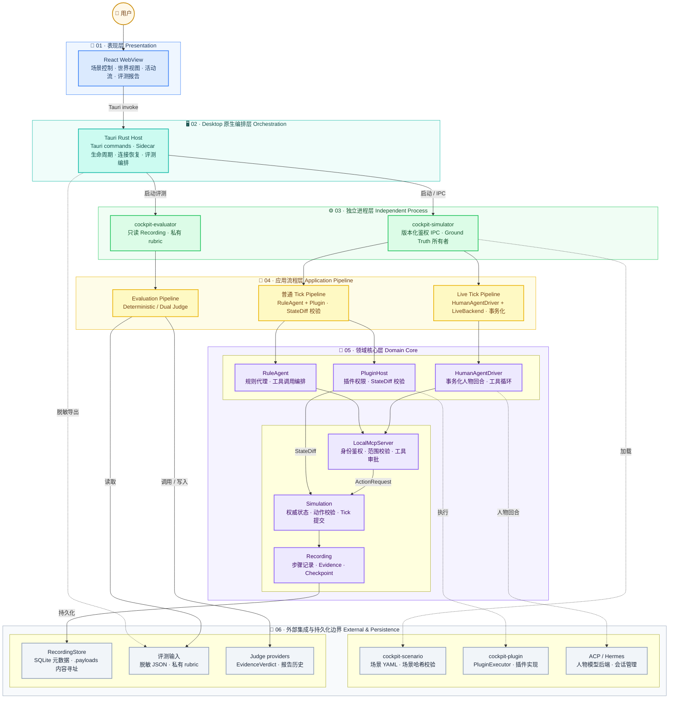
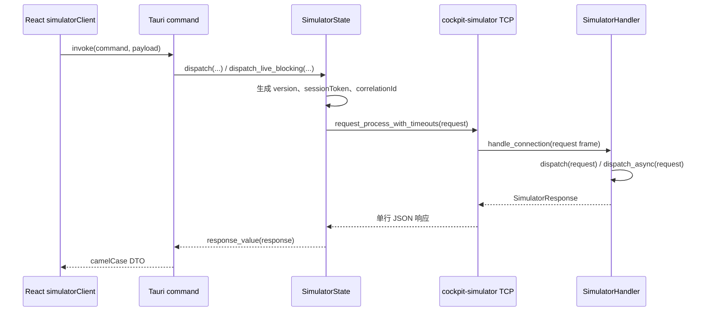
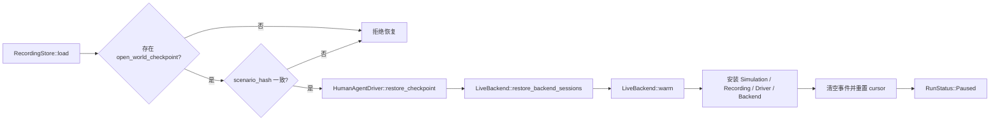
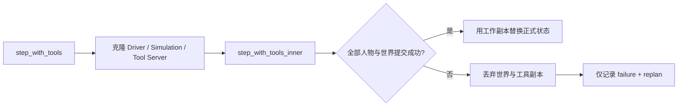
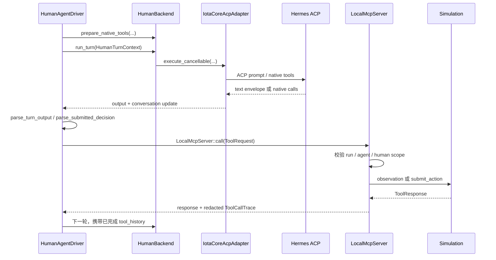
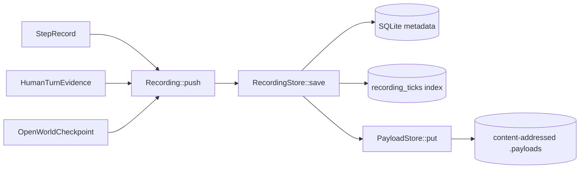
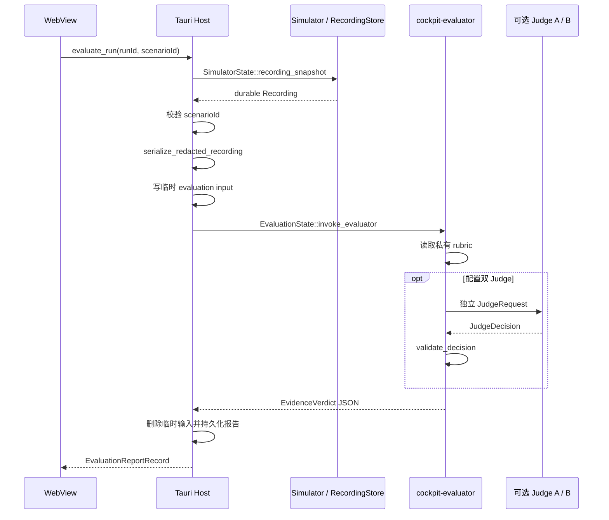

# Cockpit 运行时架构与核心流程

本文描述 Cockpit Desktop 当前代码实现的运行时架构。重点是状态所有权、进程边界、普通与 Live Tick、工具与动作校验、持久化恢复、事件同步和独立评测。

文中的方法名均对应当前仓库源码。部署参数、模型兼容性和故障排查不属于本文范围。

## 1. 架构边界与状态所有权

`cockpit-simulator` 是运行期 Ground Truth 的唯一所有者。WebView、模型后端、插件和 evaluator 都不能直接修改 `WorldSnapshot`。

所有世界变更最终进入 `cockpit_world::Simulation`。动作由 `Simulation::submit_action` 校验，Tick 由 `Simulation::commit_step` 按固定顺序提交。



总览图只表达自顶向下的职责与依赖。进程内的方法调用、请求响应和数据回流由后续流程图展开。

### 组件职责

| 组件 | 拥有的状态 | 关键入口 |
| --- | --- | --- |
| React WebView | 页面状态、事件消费游标 | `simulatorClient.*` |
| Tauri Host | Sidecar 进程、连接状态、IPC 序号、评测历史 | `SimulatorState::connect`、`dispatch`、`dispatch_live_blocking`、`EvaluationState::evaluate` |
| `cockpit-simulator` | 当前 `Simulation`、agent driver、tool server、backend、插件、事件缓冲区、Recording | `SimulatorHandler::dispatch`、`dispatch_async` |
| `cockpit-world` | `WorldSnapshot`、待提交动作、状态版本、仿真时钟 | `Simulation::submit_action`、`commit_step` |
| `cockpit-agent` | 工具网关、人物会话与调度、ACP adapter | `LocalMcpServer::call`、`HumanAgentDriver::step_with_tools` |
| `cockpit-recording` | 可重放的步骤、人物证据、开放世界 checkpoint | `RecordingStore::save`、`load`、`replay_recording` |
| `cockpit-evaluator` | 评测输入、rubric、Judge 结果与最终 verdict | `evaluate_input`、`validate_decision`、`suite::run_suite` |

依赖方向保持单向：UI 依赖 Tauri 命令，Tauri 依赖 simulator IPC，simulator 编排领域 crate。`cockpit-world` 不依赖 UI、网络、ACP、模型或 evaluator。

## 2. 进程启动与 IPC 流程

### 2.1 连接与请求

`SimulatorState::connect` 优先连接并探测已有 sidecar。没有可用外部二进制时使用内嵌 `SimulatorHandler`；外部模式由 `SimulatorState::spawn_process` 启动 simulator，并配置持久化 Recording 数据库。

WebView 通过 `simulatorClient` 调用 Tauri command。普通命令进入 `SimulatorState::dispatch`，Live 创建、恢复和单步进入 `dispatch_live_blocking`，避免阻塞 Tauri 异步执行线程。



`SimulatorHandler::dispatch` 先校验 `IPC_VERSION` 和 `session_token`，再路由同步命令。`dispatch_async` 只接管 `CreateLiveSimulationRun`、`ResumeLiveSimulation` 和 `StepLiveSimulation`。

`server::serve_listener_with` 为每条连接创建任务，但用共享的 `Arc<Mutex<SimulatorHandler>>` 串行修改仿真状态。这样多个连接不能并发提交世界状态。

### 2.2 心跳、取消与断线

`Ping` 和 `CancelLiveTurn` 在 `server::handle_connection` 中绕过 handler 锁。即使长耗时 Live Tick 正占用 handler，Desktop 仍能探活或触发 `LiveTurnControl::cancel`。

普通请求失败后，`SimulatorState::dispatch` 会恢复连接，但不会自动重放命令。响应可能在提交后丢失，因此调用方收到“结果未知”，避免重复执行非幂等操作。

`SimulatorState::run_heartbeat_loop` 使用鉴权 Ping 更新连接状态。`reconnect_with_backoff` 负责带抖动的指数退避重连。

## 3. Run 生命周期

### 3.1 创建普通 Run

`SimulatorHandler::create_run` 调用 `cockpit_scenario::load_scenario`，然后初始化 `Simulation`、`Recording`、`LocalMcpServer`、`RuleAgent`、`HumanAgentDriver`、`PluginHost` 和有界 `RecordingQueue`。

创建完成后，handler 发出 `SimulationStateChanged(Ready)`，并通过 `persist_recording` 保存初始 Recording。

### 3.2 创建 Live Run

调用链如下：

```text
simulatorClient.createLiveRun
  -> create_live_simulation_run
  -> SimulatorState::dispatch_live_blocking(CreateLiveSimulationRun)
  -> SimulatorHandler::dispatch_async
  -> SimulatorHandler::create_live_run
  -> live_run::backend_impl::backend_session
  -> LiveBackend::warm
```

`create_live_run` 会先判断是否能复用仍处于 `Ready`、tick 为 0、场景哈希相同且 timeout 相同的 backend。不能复用时，它先关闭旧 backend，再创建并预热新 backend。

预热成功后才替换 handler 内的 Simulation、Recording、driver、tool server 和 backend。随后发出 `Ready` 事件并持久化初始 Recording。

### 3.3 恢复 Live Run



入口方法是 `SimulatorHandler::resume_live_run`。checkpoint 同时恢复 `WorldSnapshot` 与 `OpenWorldRuntime`，因此人物计划、记忆、生命周期和世界 tick 必须作为一个版本化整体恢复。

恢复后的状态固定为 `Paused`。调用方必须显式继续运行，避免恢复动作本身推进世界。

## 4. Tick 执行流程

### 4.1 两条路径

| 路径 | Handler 入口 | Agent 路径 | 插件 StateDiff | 最终提交 |
| --- | --- | --- | --- | --- |
| 普通 Tick | `SimulatorHandler::step` | `RuleAgent::step_with_state_diffs` | 是 | `Simulation::step_with_state_diffs` |
| Live Tick | `SimulatorHandler::step_live` | `HumanAgentDriver::step_with_tools` | 否 | `Simulation::step_without_agent` |

插件当前只接入普通 Tick。文档和实现都不应暗示 Live ACP Tick 会自动执行插件。

### 4.2 普通 Tick

```text
SimulatorHandler::step
  -> SimulatorHandler::run_plugins
  -> PluginHost::run_tick
  -> RuleAgent::step_with_state_diffs
  -> LocalMcpServer::call
  -> Simulation::submit_action
  -> Simulation::step_with_state_diffs
  -> Simulation::commit_step
```

`run_plugins` 按已注册插件生成 `StateDiff` 和 `PluginFailure`。`RuleAgent` 通过本地工具获取 observation、请求动作，并把插件 diff 交给 world 层统一提交。

`Simulation::commit_step` 的稳定顺序是：推进数字孪生、注入故障、应用 influence、应用已验证动作、应用人物状态增量、应用排序后的 StateDiff、更新 perception，最后增加 tick 与 state version 并计算 snapshot hash。

插件失败策略由 handler 在 Tick 后处理。`PauseRun` 将运行置为 `Paused`，`FailRun` 调用 `Simulation::fail`。

### 4.3 Live Tick 的事务边界

`SimulatorHandler::step_live` 从 handler 暂时取出 `Simulation` 与 `LiveBackend`，建立取消令牌，然后调用 `HumanAgentDriver::step_with_tools`。

`step_with_tools` 不直接修改正式状态。它先克隆 driver、simulation 和 `LocalMcpServer`，在工作副本上执行 `step_with_tools_inner`。



因此，一个人物在后续轮次失败时，不会留下前面人物产生的部分动作、工具状态或世界变更。这是 Live Tick 的原子提交边界。

### 4.4 Live Tick 内部步骤

`HumanAgentDriver::step_with_tools_inner` 按以下顺序执行：

1. `prune_transient_utterances` 清理过期的临时话语文本。
2. `OpenWorldRuntime::ensure_agent` 和 `retire_agent` 同步人物会话集合。
3. `OpenWorldRuntime::schedule` 以确定性顺序选择候选人物。
4. `turn_trigger` 根据恢复、计划、紧急感知、重试或 cadence 判断是否真正调用 backend。
5. 为人物构造 `HumanTurnContext`，其中只包含授权感知、目标、长期记忆、能力和已完成工具交换。
6. 运行 ACP/tool loop，得到结构化 decision、工具 trace、控制请求和人物 evidence。
7. 将人物状态增量交给 `Simulation::submit_human_state_delta`，将话语转为延迟感知事件。
8. 调用 `Simulation::step_without_agent`，进入统一的 `commit_step`。

成功后，`step_live` 把 `StepRecord`、`HumanTurnEvidence` 和 `HumanAgentDriver::checkpoint` 写入 Recording，再持久化并发出事件。

取消时，`LiveTurnControl` 使 backend 回合退出，`step_live` 将运行置为 `Stopped`。其他 backend 或输出错误会将运行置为 `Failed`，保存失败时的 checkpoint，并发出 execution failure evaluation。

## 5. ACP、工具与动作网关

### 5.1 Backend 生命周期

Live backend 由 `live_run::backend_impl::backend_session` 创建。ACP 实现使用 `IotaCoreAcpAdapter::with_fresh_session` 建立独立会话，并由 `IotaCoreAcpAdapter::warm` 完成后端初始化。

每个人物的 `HumanBackend::run_turn` 在首次使用前检查 `IotaCoreAcpAdapter::is_warm`。冷 adapter 先 `warm`，再进入受取消和超时控制的执行方法。

adapter 通过 `build_prompt` 构造回合输入，并由 `execute_cancellable` 系列方法执行。传输可以返回文本 `toolCall` / `final` envelope，也可以返回原生 MCP 调用。

### 5.2 Tool loop



driver 同时限制每回合墙钟时间、工具调用数、工具成本和动作数。最终 decision 不允许直接携带动作；动作必须通过 `simulation.request_action` 工具产生。

原生 MCP 调用仍会在本地通过 `LocalMcpServer::call` 重放。返回值必须与 backend 提交的 native response 一致，确保授权、审计和文本协议走同一个执行边界。

### 5.3 工具授权

`LocalMcpServer::call` 依次校验：

1. `ToolRequest.run_id` 必须匹配当前 Run。
2. `agent_id` 必须匹配场景授权主体。
3. 有 `human_id` 时，人物必须存在于当前世界。
4. 动作工具必须属于该人物的 `action_capabilities`。
5. 工具响应不得超过大小上限。

所有调用都会生成 `ToolCallTrace`。参数和结果经 `redact_json` 清理敏感字段后才进入 Recording。

### 5.4 动作提交与审批

`LocalMcpServer::request_action` 把 wire command 解析为 capability，并构造带 `expected_state_version` 与 `expires_at_tick` 的 `ActionRequest`。

未启用审批时，它立即调用 `Simulation::submit_action`。启用审批时，动作进入 `pending_actions`，Desktop 通过 `approve_action` 或 `reject_action` 完成后续处理。

`Simulation::validate_action` 校验 capability grant、过期时间、状态版本、写集合冲突、目标和具体 effect 前置条件。通过校验的动作只进入待提交集合，真正 effect 在 `Simulation::apply_pending_actions` 中确定性排序后应用。

## 6. Recording、事件、重放与评测

### 6.1 Recording 持久化

`Recording` 保存场景与版本元数据、`StepRecord`、人物回合证据和可选 `open_world_checkpoint`。

`RecordingStore::save` 在单个 SQLite 事务中更新 Recording 元数据和 Tick 索引。每个 Tick payload 先脱敏，再由 `PayloadStore::put` 按 SHA-256 内容哈希写入同名 `.payloads` 目录。



普通 Tick 先进入有界 `RecordingQueue`。队列结果可以是 `Enqueued`、`Dropped`、`Paused` 或 `Failed`；后两种会改变 Run 状态并发出 `RECORDING_QUEUE_OVERFLOW`。

Live Tick 当前直接追加 `StepRecord`、人物证据和 checkpoint，然后调用 `persist_recording`。

### 6.2 事件与游标

`SimulatorHandler::emit` 为每个 `SimulatorEvent` 分配单调递增 cursor。`events_after` 返回指定 cursor 之后的事件，`cursor_reset_required` 判断请求位置是否早于当前缓冲区。

Desktop 的 `get_simulation_events` 返回 `events`、`nextCursor`、`firstAvailableCursor` 和 `resetRequired`。WebView 的 `simulatorClient.snapshot` 持有并推进消费游标。

当 `resetRequired=true` 时，调用方应通过 `get_simulation_snapshot` 获取权威快照，再从新的 cursor 继续消费。事件流是增量视图，不是 Ground Truth。

### 6.3 重放与差异

`replay_recording` 在执行前校验场景哈希、runtime contract version、world model version 和 clock。随后按 Tick 重放已记录动作与 StateDiff，并重新计算 snapshot hash。

Simulator 的 `start_replay` 调用该函数并安装 replay 结果。`diff_recordings` 通过 `cockpit_recording::diff_recordings` 比较两个 Recording 的指标和 Tick 差异。

### 6.4 Desktop 独立评测

Desktop 评测不会把私有 rubric 交给 simulator 或 Live 模型。



`SimulatorState::recording_snapshot` 在外部 sidecar 模式下以只读方式加载数据库，并用当前 snapshot 验证 Recording 已持久化到权威位置。内嵌模式直接从 handler 复制 Recording。

`EvaluationState::evaluate` 调用 `serialize_redacted_recording`，移除 secret、prompt、reasoning、narrative 和 utterance prose。随后 `invoke_evaluator` 以 `--recording` 和 `--rubric` 启动独立进程。

`evaluate_input` 未配置 Judge 时运行 `DeterministicEvaluator`。配置成对的 Judge 时运行 `DualJudgeEvaluator`；`validate_decision` 校验 rubric/schema provenance、置信度和 evidence 是否确实存在于 Recording。

evaluator CLI 还支持 `RecordingStore::open_read_only` 直接读取 SQLite，以及 `suite::run_suite` 执行批量场景、baseline 比较和 release gate。这些是 CLI 路径，不是 Desktop `evaluate_run` 的默认数据流。

## 7. 关键不变量与失败语义

| 不变量 | 实现位置 | 失败结果 |
| --- | --- | --- |
| 世界状态只能由 `Simulation` 提交 | `Simulation::submit_action`、`commit_step` | 返回 `ActionResult` 或 `SimulationError` |
| Live Tick 不得部分提交 | `HumanAgentDriver::step_with_tools` | 丢弃工作副本，记录 failure/replan |
| 插件输出必须经过 StateDiff 校验 | `run_plugins`、`Simulation::apply_state_diffs` | 按插件策略降级、暂停或失败 |
| IPC 必须版本与会话匹配 | `SimulatorHandler::dispatch` | `IPC_VERSION_UNSUPPORTED` 或鉴权错误 |
| 断线后不自动重放未知命令 | `SimulatorState::dispatch*` | 恢复连接并返回 outcome unknown |
| Live 取消不能等待 handler 锁 | `server::handle_connection`、`LiveTurnControl` | 当前运行进入 `Stopped` |
| Recording 必须可验证和可恢复 | `RecordingStore::save/load`、checkpoint | 拒绝损坏、缺失或场景不匹配的数据 |
| 私有 rubric 不进入执行平面 | `EvaluationState::evaluate`、evaluator CLI | rubric 只存在于独立评测进程 |
| Judge 结论必须引用真实证据 | `validate_decision` | 拒绝无效 provenance 或 evidence |

## 代码导航

| 主题 | 实现文件 |
| --- | --- |
| Desktop simulator 生命周期与 IPC | [`apps/cockpit-desktop/src-tauri/src/simulator_commands.rs`](../apps/cockpit-desktop/src-tauri/src/simulator_commands.rs) |
| Desktop 独立评测 | [`apps/cockpit-desktop/src-tauri/src/evaluation_commands.rs`](../apps/cockpit-desktop/src-tauri/src/evaluation_commands.rs) |
| Simulator TCP server | [`crates/cockpit-simulator/src/server.rs`](../crates/cockpit-simulator/src/server.rs) |
| IPC 路由与事件 | [`crates/cockpit-simulator/src/ipc/handler.rs`](../crates/cockpit-simulator/src/ipc/handler.rs) |
| Run 创建、恢复与 Tick | [`crates/cockpit-simulator/src/ipc/lifecycle.rs`](../crates/cockpit-simulator/src/ipc/lifecycle.rs) |
| 插件、Recording、事件查询 | [`crates/cockpit-simulator/src/ipc/control.rs`](../crates/cockpit-simulator/src/ipc/control.rs) |
| Live backend 组合 | [`crates/cockpit-simulator/src/live_run.rs`](../crates/cockpit-simulator/src/live_run.rs) |
| Live 人物事务与 tool loop | [`crates/cockpit-agent/src/live/driver.rs`](../crates/cockpit-agent/src/live/driver.rs) |
| ACP adapter | [`crates/cockpit-agent/src/acp_adapter.rs`](../crates/cockpit-agent/src/acp_adapter.rs) |
| 本地工具与动作申请 | [`crates/cockpit-agent/src/lib.rs`](../crates/cockpit-agent/src/lib.rs) |
| 权威世界提交 | [`crates/cockpit-world/src/simulation.rs`](../crates/cockpit-world/src/simulation.rs) |
| Recording 存储与脱敏 | [`crates/cockpit-recording/src/store.rs`](../crates/cockpit-recording/src/store.rs) |
| Recording 重放 | [`crates/cockpit-recording/src/replay.rs`](../crates/cockpit-recording/src/replay.rs) |
| 独立 evaluator | [`crates/cockpit-evaluator/src/main.rs`](../crates/cockpit-evaluator/src/main.rs) |
