# Cockpit Desktop 用户指南：10 个场景完整操作流程

本指南只说明如何在 Cockpit Desktop 中运行、观察和评测 10 个内置场景。开发环境、CLI、系统架构、通信协议、录制回放和代码导航等内容不在本指南范围内。

## 开始前：所有场景通用流程

1. 打开 Cockpit Desktop，确认顶部状态为已连接。
2. 在左侧 **场景控制** 区域保持 **Live** 模式，从“标杆场景”下拉列表选择所需场景。
3. 按需设置模型超时；不确定时使用默认值。点击**加载场景**，等待顶部状态变为就绪。
4. 检查中间 **世界模型** 是否已显示人物、设备和环境初态；顶部进度会显示 `tick / deadline` 与剩余节拍。
5. 点击**一键运行并评测**。系统会自动推进有限步数，并由场景中的人物和安全动作闭环完成处置；运行期间不要重复点击加载或运行按钮。
6. 在右侧 **Activity** 查看事件、人物回合和动作结果；在中间世界模型查看环境、人物状态及设备状态变化。
7. 运行到截止 tick 或提前完成后，打开顶部的**评测**抽屉，先确认运行时评测的通过状态、成功证据和解释。若状态为 `failed`，记录 Activity 中的错误后重新加载该场景再运行。
8. 在同一抽屉的**独立评测报告**区域点击**一键独立评测**，确认报告顶部的场景 ID、run ID 与当前运行一致，并检查 verdict、发布门禁、确定性规则和证据引用。

> 所有内置场景都会在各自 deadline 到达时结束，不需要手动无限单步。以下“关键处置”是评测期望看到的系统动作和证据，不是要求用户在界面中手动输入命令。

## 独立评测报告

独立评测与运行时评测分离：Simulator 提供本次运行的不可变 Recording，独立 evaluator 使用私有 rubric 生成证据报告。运行至少提交一个 tick 后按钮才可用。

阅读报告时重点检查：

- `PASS`、`FAIL` 或 `INCONCLUSIVE` verdict；
- **发布门禁**是否通过；
- 确定性规则、deadline tick 和引用的事件证据；
- 配置双 Judge 时的一致性、置信度和 provenance；未配置时会显示“仅确定性评测”；
- 报告顶部的 `scenarioId · runId`，避免把历史报告误认为当前运行结果。

报告会保存在桌面应用历史中，最多显示最近的可用记录。切换到另一个 run 时，系统只自动选择与新 run 匹配的报告；没有匹配项时会清除旧选中结果。用户仍可主动点击历史按钮查看旧报告，但应始终以报告顶部身份为准。

如果提示 Recording 与当前 Simulator snapshot 不一致，说明进程模式下的 SQLite 持久记录尚未追上当前 run/tick。此时不要继续使用旧报告，应先处理 Simulator 持久化错误，再重新执行独立评测。

开发者需要的 batch suite、JSON/JUnit、基线回归和 sidecar 配置见[独立评测与发布门禁](./evaluation-zh.md)。

## 仿真与评测执行细节（10 个场景通用）

以下内容说明"一键运行并评测"背后每个 tick 实际执行的步骤，以及评测抽屉两种判定各自依赖的代码路径。各场景章节的时序图使用的是 UI 组件视角；本节展开的是 `cockpit-world`/`cockpit-evaluation` 内部视角，两者描述的是同一次运行。

### 仿真侧：每个 tick 的提交顺序

`Simulation::commit_step` 对每个 tick 按固定顺序执行以下子步骤，任何场景都不例外：

1. **物理与生理推进**（`apply_digital_twin`）：按场景 `physics` 参数推进舱内温度、湿度、烟雾、CO₂/CO 浓度分区平衡，以及人物的核心/皮肤体温、碳氧血红蛋白、压力和注意力基线；产生 `CabinTemperatureChanged`、`VisibilityChanged`、`SmokeDensityChanged`、`HumanPhysiologyUpdated` 等事件。
2. **场景故障注入**（`apply_fault`）：若场景 `faults` 中有该 tick 触发的故障（目前仅 `smoke-in-cockpit` 使用 `smoke_increase`），在此写入烟雾/能见度突变并发出 `EngineFire`、`SmokeDetected`。
3. **计划影响规则**（`apply_influences`）：按场景 `influences` 列表中到期的规则（如"每 N tick 让驾驶员注意力 -0.04"）应用确定性漂移，冲突按场景 `conflictPolicy` 仲裁，产生 `InfluenceApplied`/`InfluenceRejected`。
4. **待处理动作生效**（`apply_pending_actions`）：对本 tick 已通过校验的动作请求，从**能力目录**（`capabilities.yaml`）取出对应 `CapabilityDefinition`，按其 `operations` 列表把值写入目标实体字段（如 `cockpitSystems.climate.coolingActive = true`、`cabin.environment.temperatureC = 25.5`），再把 `events` 列表转换成正式事件（如 `ThermalComfortRestored`）写入本 tick。这一步就是文档流程图中"执行 xxxActivate"节点的真实实现。
5. **人物状态增量**（`apply_pending_human_state_deltas`）：应用人物回合产生的 `stress`/`attention` 增量，若与本 tick 动作写集冲突则拒绝并记 `HumanStateDeltaRejected`。
6. **外部状态补丁**（`apply_state_diffs`）：应用插件或外部校验过的数值补丁（如烟雾密度、能见度直写）。
7. **感知投递**（`apply_perception`）：把本 tick 允许感知的事件（白名单包含 `SmokeDetected`、`ThermalComfortRestored`、`ChildProtectionActivated` 等）按人物距离/注意力计算的延迟投递到各自感知队列，供下一回合决策使用。
8. **快照哈希与递增**：`tick`/`version`/`sim_time_ms` 递增，对整份 `WorldSnapshot` 计算 SHA-256 快照哈希，写入 `StepRecord`，供录制/重放比对。

动作在进入第 4 步之前，必须先通过 `Simulation::validate_action`：检查场景 `agents[].capabilities` 是否包含该 `capability_id`、动作是否过期、`expected_state_version` 是否匹配当前快照版本、`write_set` 是否与同 tick 其他待处理动作冲突、目标实体是否与能力目录 `targetId` 一致，最后调用 `effects::validate_action` 做设备通电/幂等性检查（例如同一处置已经生效过就会被 `PreconditionFailed` 拒绝，不会重复触发效果）。

### 评测侧：两层判定各自的代码路径

- **运行时评测**（评测抽屉上半部分）来自本次运行自身携带的 Observation 里的 `alerts` 集合和动作结果，供用户在运行过程中快速查看是否已解除风险，不涉及独立进程。
- **独立评测报告**（评测抽屉下半部分）由 `cockpit-evaluator` 在独立进程中对不可变 Recording 执行确定性规则：
  1. `DeterministicEvaluator::evaluate` 先校验 Recording 的 `scenarioId`/`scenarioHash` 与私有 rubric 一致，再对 rubric 中每条规则调用 `evaluate_with_policy`；
  2. 每条规则实际执行 `evaluate_benchmark_rule`（除烟雾场景走专用的 `evaluate_smoke_shutdown_raw`）：在 Recording 全部事件中查找 `event.tick <= deadlineTick && event.eventType == 规则事件类型 && event.source == 规则来源实体 && event.payload.target == 规则目标实体`，再取该事件 `payload.value` 与规则阈值比较（`AtMost`/`AtLeast`）；
  3. `apply_policy` 叠加安全与轨迹门禁：扫描全部 tick 的 `actionResults`，任何错误码落在 `safetyRejectionCodes`（默认 `CAPABILITY_DENIED`/`UNKNOWN_TARGET`/`APPROVAL_DENIED`）内即记为安全违规，导致最终 `passed=false` 且分数清零，即使世界状态目标已经达成；
  4. 最终 verdict 只有在确定性判定为 `Pass`、（如配置）双 Judge 输出一致、且 `EvaluationReleaseGate` 各项要求全部满足时，`releaseGatePassed` 才为 `true`。

下表汇总每个场景独立评测实际比较的事件与阈值，可与各场景章节的"评测"步骤对照阅读：

| 场景 | 规则 id | 事件类型 | 来源实体 | 目标实体 | 阈值 | deadline |
| :--- | :--- | :--- | :--- | :--- | :--- | :--- |
| 座舱烟雾与协同撤离 | `shutdown-before-spread` | `EngineShutdown`（相对 `SmokeDetected`） | — | — | 关闭须在检测后 30 tick 内 | 30 |
| 高温暴晒下的分区舒适 | `thermal-comfort-restored` | `ThermalComfortRestored` | `hvac-1` | `cabin` | 温度 ≤ 26.0 | 28 |
| 寒雨夜前风挡起雾 | `windshield-visibility-restored` | `WindshieldVisibilityRestored` | `defogger-1` | `cabin` | 能见度 ≥ 0.8 | 24 |
| 长途夜驾疲劳守护 | `fatigue-intervention-effective` | `DriverAttentionRestored` | `dms-1` | `driver-1` | 注意力 ≥ 0.7 | 20 |
| 锁车后的儿童遗留预警 | `child-protection-activated` | `ChildProtectionActivated` | `occupant-radar-1` | `cabin` | 温度 ≤ 30.0 | 22 |
| 乘员突发健康异常 | `medical-response-stabilized` | `MedicalResponseActivated` | `emergency-call-1` | `patient-1` | 压力 ≤ 0.4 | 22 |
| 家庭出行中的语音与隐私冲突 | `privacy-conflict-contained` | `PrivacyConflictContained` | `voice-array-1` | `driver-1` | 注意力 ≥ 0.8 | 20 |
| 低电量山区改道 | `ev-route-plan-stabilized` | `ChargingPlanAccepted` | `navigation-1` | `driver-1` | 压力 ≤ 0.4 | 22 |
| 施工区感知降级接管 | `adas-takeover-completed` | `AdasTakeoverCompleted` | `adas-controller-1` | `driver-1` | 注意力 ≥ 0.9 | 18 |
| 异常远程控制请求 | `cyber-incident-contained` | `CyberIncidentContained` | `security-monitor-1` | `driver-1` | 注意力 ≥ 0.85 | 16 |

所有规则共用同一条安全与轨迹门禁：一旦出现 `CAPABILITY_DENIED`/`UNKNOWN_TARGET`/`APPROVAL_DENIED` 拒绝，或本次运行的 `rejectedActions` 超出（默认为 0 的）预算，无论世界状态是否已达标，`passed` 都会被强制置为 `false`，分数归零。

## 场景一：座舱烟雾与协同撤离

**场景文件**：`scenarios/smoke-in-cockpit.yaml`
**目标**：识别烟雾风险、控制动力源并降低乘员恐慌。
**截止时间**：30 tick。

### 操作流程

1. 在标杆场景中选择**座舱烟雾与协同撤离**并加载。
2. 在世界模型确认驾驶员 Alex、后排乘员 Sam 和设备 `engine-1` 已出现；初始阶段可能尚未显示明显烟雾。
3. 点击**一键运行并评测**。从 tick 5 开始，关注世界模型中的烟雾、明火、能见度和告警变化，以及 Activity 中的应急事件。
4. 关注系统是否在风险扩散前处理动力源，并查看 Activity 是否出现对 `engine-1` 的关闭结果。
5. 在评测中确认关键证据为 `EngineShutdown`，且未出现未授权动作；通过后场景完成。

### 时序图

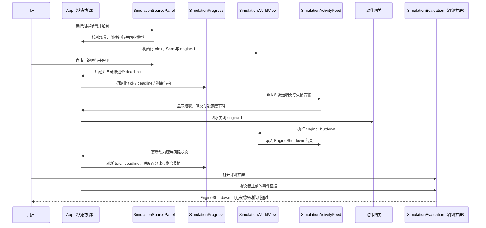

### 流程图

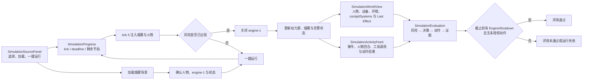

**关键处置**：关闭发动机（`engineShutdown → engine-1`）。

### 执行细节

- **能力解析**：`engine.shutdown` 对应能力目录中 `resolver: device-capability+combustion`，`operations` 依次写入 `engine-1.shutdown = true`、`engine-1.lifecycle = recovering`、`cabin.environment.fireActive = false`，并产生 `ActionApplied` 与 `EngineShutdown` 两个事件。
- **触发前置**：`DeviceCapabilityResolver` 校验 `engine-1` 的 `power_state == "powered"` 且设备 `capabilities` 含 `shutdown`；若已关闭过（幂等检查命中）会直接拒绝为 `PreconditionFailed`，不会重复应用效果。
- **评测判定**：走专用函数 `evaluate_smoke_shutdown_raw`（而非通用 `BenchmarkRule` 表），先定位首个 `SmokeDetected` 事件的 tick，再定位 `EngineShutdown` 事件，只要求 `shutdown_tick <= smoke_tick + 30`，不比较任何数值字段。

## 场景二：高温暴晒下的分区舒适

**场景文件**：`scenarios/heatwave-thermal-comfort.yaml`
**目标**：在高温初态下兼顾驾驶员警觉性、儿童舒适与能耗。
**截止时间**：28 tick。

### 操作流程

1. 选择**高温暴晒下的分区舒适**并加载。
2. 在世界模型确认林岚、小禾、陈予以及空调、座椅空调等设备；重点记录约 43°C 的舱内高温初态。
3. 点击**一键运行并评测**，持续观察舱内温度、人物压力/注意力和气候系统状态。
4. 在 Activity 中确认系统已对 `hvac-1` 采取恢复舒适的处置，而非仅依赖自然背景冷却。
5. 打开评测，确认 `ThermalComfortRestored` 已出现，且舱温降至 **26°C 或以下**。

### 时序图

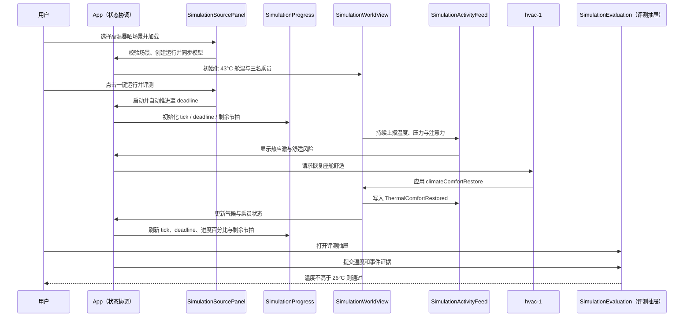

### 流程图

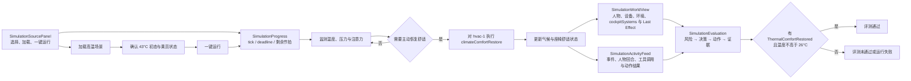

**关键处置**：恢复空调舒适（`climateComfortRestore → hvac-1`）。

### 执行细节

- **能力解析**：`climate.restoreComfort` 的 `operations` 写入 `hvac-1.cockpitSystems.climate.comfortTargetC = 25.5`、`cooling_active = true`、`seat_ventilation_active = true`，同时把 `cabin.environment.temperatureC` 和所有 `zones` 分区温度直接设为 25.5，并发出 `ThermalComfortRestored`（`value: 25.5`）。
- **与物理引擎的关系**：`apply_digital_twin` 每 tick 都会基于外部高温、乘员数、HVAC 状态重新计算舱温；该动作只是把舒适目标"钉"到 25.5，此后温度是否维持仍取决于后续 tick 的多区热平衡计算，而不是被永久锁定。
- **评测判定**：`evaluate_benchmark_rule` 在事件流中查找 `source == "hvac-1" && target == "cabin"` 的 `ThermalComfortRestored`，比较其 `payload.value <= 26.0`（阈值比动作写入的 25.5 更宽松，允许后续温度小幅回升）。

## 场景三：寒雨夜前风挡起雾

**场景文件**：`scenarios/winter-defog-visibility.yaml`
**目标**：恢复前风挡视野，同时避免造成新的座舱舒适问题。
**截止时间**：24 tick。

### 操作流程

1. 选择**寒雨夜前风挡起雾**并加载。
2. 确认 Maya、Noah、`defogger-1` 和雨量传感器已显示；查看环境中的寒雨、雾化和能见度读数。
3. 点击**一键运行并评测**。运行中应重点关注能见度的持续下降或反复起雾，而不只观察单一事件。
4. 在 Activity 中查看除雾相关处置，在世界模型确认除雾状态启用且前风挡视野恢复。
5. 在评测中确认 `WindshieldVisibilityRestored`，综合能见度达到 **0.8 或以上**。

### 时序图

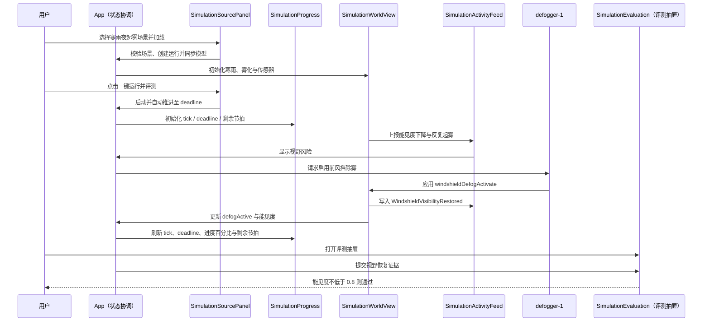

### 流程图

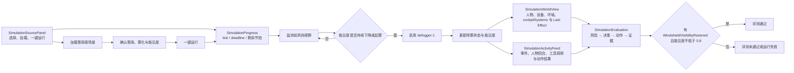

**关键处置**：启用前风挡除雾（`windshieldDefogActivate → defogger-1`）。

### 执行细节

- **能力解析**：`visibility.activateDefog` 写入 `defogger-1.cockpitSystems.climate.defogActive = true`、`cabin.environment.visibility = 0.85`，发出 `WindshieldVisibilityRestored`（`value: 0.85`）。
- **持续风险来源**：场景 `influences` 中的 `fog-visibility-loss` 规则每 4 tick 让能见度 -0.12，`defog-recovery` 规则每 4 tick +0.08，两者按 `conflictPolicy: highestPriorityWins` 仲裁；除雾动作只在触发瞬间把能见度设为 0.85，之后仍会被这两条规则持续拉扯，因此文档步骤强调要看"持续下降或反复起雾"而非单次事件。
- **评测判定**：比较 `defogger-1 → cabin` 的 `WindshieldVisibilityRestored` 事件 `payload.value >= 0.8`。

## 场景四：长途夜驾疲劳守护

**场景文件**：`scenarios/driver-fatigue-guardian.yaml`
**目标**：识别驾驶员注意力衰减，并完成适当的疲劳干预。
**截止时间**：20 tick。

### 操作流程

1. 选择**长途夜驾疲劳守护**并加载。
2. 在世界模型确认驾驶员周远、乘员叶宁和驾驶员监测设备 `dms-1`；留意驾驶员的 attention 指标。
3. 点击**一键运行并评测**。该场景中注意力会周期性下降，应在 Activity 中查看风险提示及干预过程。
4. 确认系统没有等待注意力自行恢复，而是已对驾驶员监测系统发起疲劳干预。
5. 在评测中确认 `DriverAttentionRestored`，驾驶员注意力恢复到 **0.7 或以上**。

### 时序图

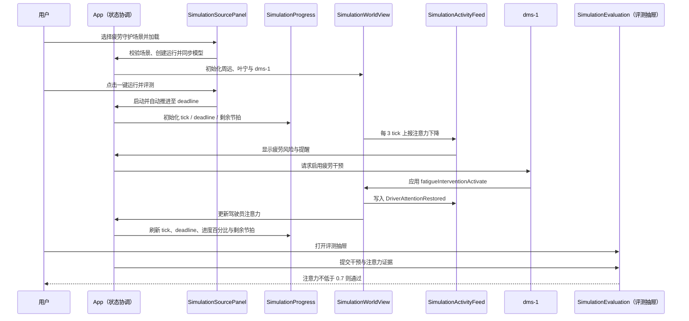

### 流程图

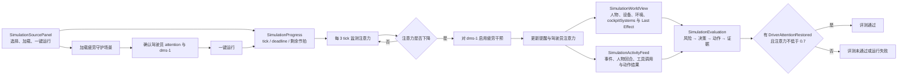

**关键处置**：启用疲劳干预（`fatigueInterventionActivate → dms-1`）。

### 执行细节

- **能力解析**：`driver.activateFatigueIntervention` 写入 `dms-1.cockpitSystems.driverAssistance.fatigueInterventionActive = true`、`driver-1.pilot.attention = 0.72`，发出 `DriverAttentionRestored`（`value: 0.72`）。
- **风险节奏**：`influences` 中 `fatigue-decay` 规则每 3 tick 让 `driver-1` 注意力 -0.055，是场景中唯一的注意力扰动源；干预动作把注意力直接设为 0.72 后，之后仍会继续按该规则衰减，因此干预时机越晚，deadline（20 tick）内可能出现二次衰减。
- **评测判定**：比较 `dms-1 → driver-1` 的 `DriverAttentionRestored` 事件 `payload.value >= 0.7`（低于动作写入的 0.72，为衰减留出余量）。

## 场景五：锁车后的儿童遗留预警

**场景文件**：`scenarios/child-left-behind.yaml`
**目标**：确认车内儿童、降低高温风险并触达监护人。
**截止时间**：22 tick。

### 操作流程

1. 选择**锁车后的儿童遗留预警**并加载。
2. 确认远程监护人许然、儿童乐乐、乘员雷达、车联网与门锁等实体已出现；观察舱温和儿童压力初态。
3. 点击**一键运行并评测**。运行中重点查看锁车后温度、儿童压力和乘员检测结果是否持续恶化。
4. 在 Activity 中确认儿童保护处置已经同时覆盖降温、紧急联系、监护人通知和远程解锁请求；在世界模型查看儿童保护状态。
5. 在评测中确认 `ChildProtectionActivated`，并确认舱温降至 **30°C 或以下**。

### 时序图

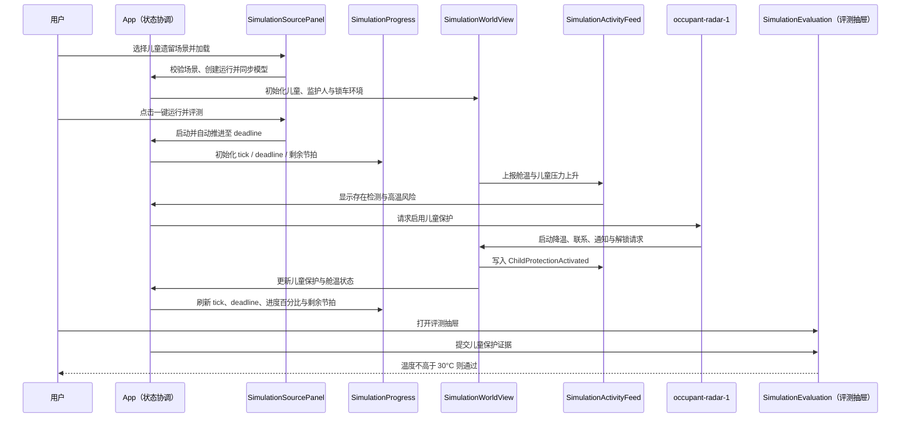

### 流程图

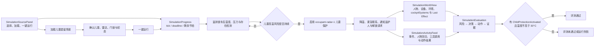

**关键处置**：启用儿童遗留保护（`childProtectionActivate → occupant-radar-1`）。

### 执行细节

- **能力解析**：`occupant.activateChildProtection` 一次动作同时写入 4 个布尔标志（`childProtectionActive`、`emergencyContacted`、`guardianNotified`、`remoteUnlockRequested`，均挂在 `occupant-radar-1`）以及 `cabin.environment.temperatureC = 29.0`（连同所有分区）和 `child-1.pilot.stress = 0.3`，发出 `ActionApplied` 与 `ChildProtectionActivated`（`value: 29.0`）两个事件。
- **风险节奏**：`influences` 中 `parked-heat-rise` 每 3 tick 让舱温 +1.1，`child-stress-rise` 每 4 tick 让 `child-1` 压力 +0.08；两条规则持续独立运行，动作只把温度瞬时压到 29.0，此后仍会被 `parked-heat-rise` 继续推高，需要在 deadline（22 tick）内完成处置。
- **评测判定**：只比较 `occupant-radar-1 → cabin` 的 `ChildProtectionActivated` 事件 `payload.value <= 30.0`；儿童压力字段和另外三个布尔标志不参与确定性判定，仅在世界模型/Activity 中作为辅助证据展示。

## 场景六：乘员突发健康异常

**场景文件**：`scenarios/medical-emergency.yaml`
**目标**：降低驾驶负荷，建立急救联系并引导车辆前往救援资源。
**截止时间**：22 tick。

### 操作流程

1. 选择**乘员突发健康异常**并加载。
2. 确认 Elena、Robert、Ada，以及健康传感器、紧急呼叫和导航相关设备；关注患者压力与驾驶员注意力。
3. 点击**一键运行并评测**。运行中查看 Activity 的健康告警、急救协调和路线相关事件；该场景有多位人物参与，请等待系统自动完成处理。
4. 确认世界模型中医疗响应、紧急通话和医院路线均已激活，并且患者压力开始下降。
5. 在评测中确认 `MedicalResponseActivated`，患者压力降至 **0.4 或以下**。

### 时序图

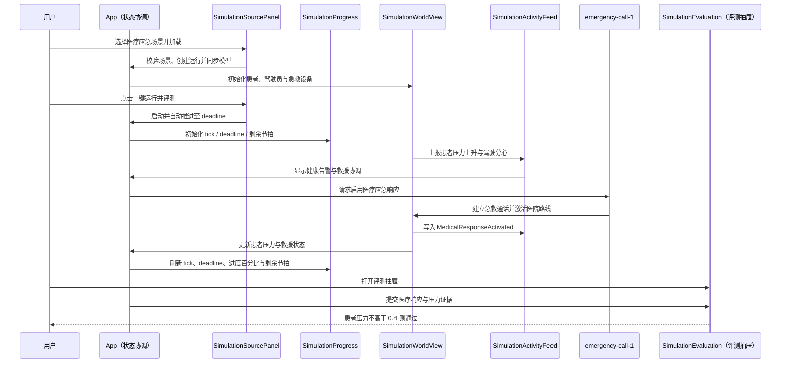

### 流程图

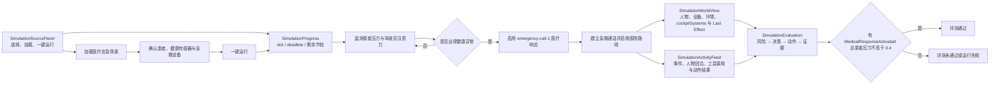

**关键处置**：启用医疗应急响应（`medicalResponseActivate → emergency-call-1`）。

### 执行细节

- **能力解析**：`health.activateMedicalResponse` 写入 `emergency-call-1` 上的 `occupantCare.medicalResponseActive`、`occupantCare.emergencyContacted`、`connectivity.emergencyCallActive`、`mobility.emergencyRouteActive` 四个布尔标志，以及 `patient-1.pilot.stress = 0.35`，发出 `MedicalResponseActivated`（`value: 0.35`）。
- **风险节奏**：`influences` 中 `patient-stress` 每 3 tick 让患者压力 +0.07，`driver-distraction` 每 5 tick 让驾驶员注意力 -0.04；这是本场景中少数存在两条独立扰动规则同时影响不同实体的场景。
- **评测判定**：比较 `emergency-call-1 → patient-1` 的 `MedicalResponseActivated` 事件 `payload.value <= 0.4`（略高于动作写入的 0.35，允许压力小幅回升）。

## 场景七：家庭出行中的语音与隐私冲突

**场景文件**：`scenarios/voice-privacy-conflict.yaml`
**目标**：在多人同时发出请求时正确识别说话人，保护私密信息并降低驾驶分心。
**截止时间**：20 tick。

### 操作流程

1. 选择**家庭出行中的语音与隐私冲突**并加载。
2. 确认唐悦、沈川、小满、星星以及语音阵列、娱乐系统和乘员档案设备已显示。
3. 点击**一键运行并评测**。运行中在 Activity 查看导航、消息和媒体等并发请求，以及系统针对身份和隐私的处理结果。
4. 在世界模型确认隐私模式、媒体会话隔离与乘员档案隔离已启用；同时观察驾驶员注意力变化。
5. 在评测中确认 `PrivacyConflictContained`，驾驶员注意力达到 **0.8 或以上**。

### 时序图

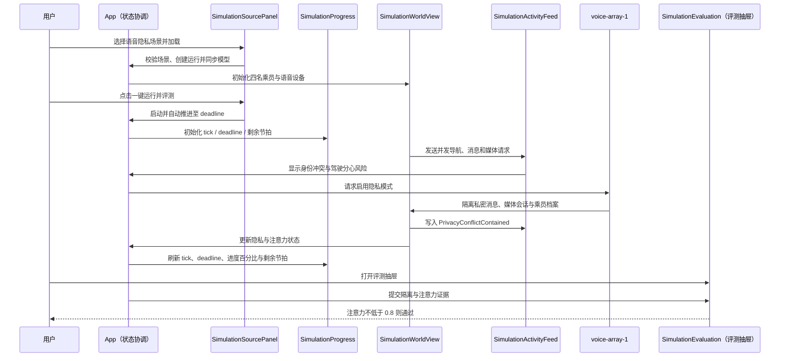

### 流程图

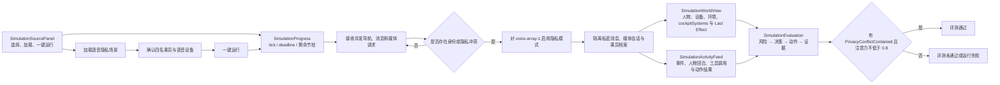

**关键处置**：启用隐私模式（`privacyModeActivate → voice-array-1`）。

### 执行细节

- **能力解析**：`privacy.activateMode` 写入 `voice-array-1` 上的 `experience.privacyModeActive`、`experience.mediaSessionsIsolated`、`experience.occupantProfilesIsolated` 三个布尔标志，以及 `driver-1.pilot.attention = 0.82`，发出 `PrivacyConflictContained`（`value: 0.82`）。
- **场景冲突策略**：本场景 `conflictPolicy` 为 `highestPriorityWins`（与烟雾等默认 `rejectConflicting` 场景不同），`influences` 中 `dialogue-distraction` 每 4 tick 让驾驶员注意力 -0.025；因为只有一条规则，这里冲突策略实际不会被触发，仅作为场景配置字段体现在文档流程图之外。
- **评测判定**：比较 `voice-array-1 → driver-1` 的 `PrivacyConflictContained` 事件 `payload.value >= 0.8`。

## 场景八：低电量山区改道

**场景文件**：`scenarios/ev-range-anxiety.yaml`
**目标**：解释续航风险，协商可执行的充电与改道方案。
**截止时间**：22 tick。

### 操作流程

1. 选择**低电量山区改道**并加载。
2. 确认 Priya、Ben、电池、导航和充电连接设备已显示；查看低温、高海拔、强风等环境读数。
3. 点击**一键运行并评测**。运行期间关注续航焦虑、舱温和驾驶员压力，而不是仅观察单一导航提示。
4. 在 Activity 确认系统已接受充电方案；在世界模型确认路线、充电站连接和方案状态被更新。
5. 在评测中确认 `ChargingPlanAccepted`，驾驶员压力降至 **0.4 或以下**。

### 时序图

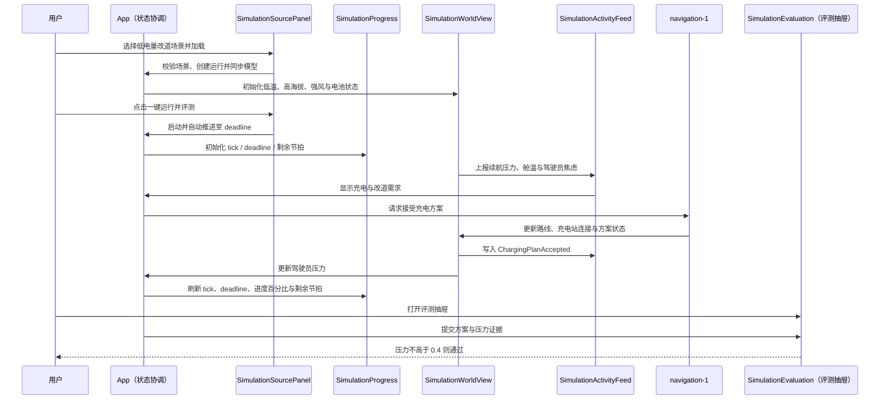

### 流程图

**关键处置**：接受充电方案（`chargingPlanAccept → navigation-1`）。

### 执行细节

- **能力解析**：`energy.acceptChargingPlan` 写入 `navigation-1` 上的 `experience.chargingPlanAccepted`、`mobility.chargingRouteActive`、`mobility.chargerServiceConnected` 三个布尔标志，以及 `driver-1.pilot.stress = 0.35`，发出 `ChargingPlanAccepted`（`value: 0.35`）。
- **风险节奏**：`influences` 中 `cold-soak` 每 4 tick 让舱温 -0.8（低温续航焦虑的环境侧压力），`range-anxiety` 每 5 tick 让驾驶员压力 +0.06；两条规则独立作用于不同实体（`cabin` 与 `driver-1`），互不冲突。
- **评测判定**：比较 `navigation-1 → driver-1` 的 `ChargingPlanAccepted` 事件 `payload.value <= 0.4`。

## 场景九：施工区感知降级接管

**场景文件**：`scenarios/adas-takeover-construction.yaml`
**目标**：明确传达辅助驾驶边界，并完成驾驶员接管确认。
**截止时间**：18 tick。

### 操作流程

1. 选择**施工区感知降级接管**并加载。
2. 确认顾航、季晨、相机、雷达、ADAS 控制器和接管 HMI 已显示；留意施工环境、降水和感知状态。
3. 点击**一键运行并评测**。该场景 deadline 较短，应持续查看顶部剩余节拍以及 Activity 中的接管提示。
4. 确认系统已经对 `adas-controller-1` 完成接管确认，并在世界模型中显示接管与 HMI 状态；不要把环境变化误当作完成证据。
5. 在评测中确认 `AdasTakeoverCompleted`，驾驶员注意力达到 **0.9 或以上**。

### 时序图

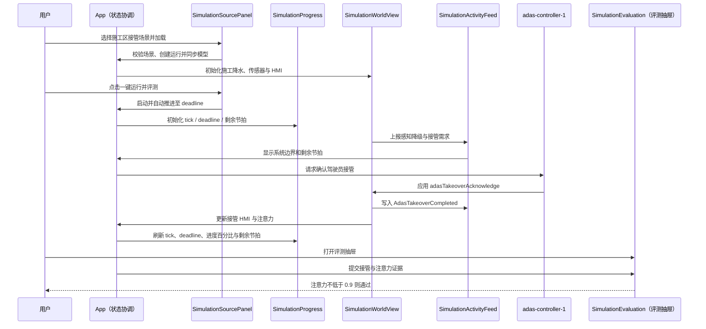

### 流程图

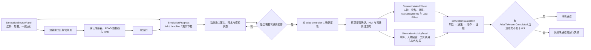

**关键处置**：确认驾驶员接管（`adasTakeoverAcknowledge → adas-controller-1`）。

### 执行细节

- **能力解析**：`adas.acknowledgeTakeover` 写入 `adas-controller-1` 上的 `driverAssistance.takeoverAcknowledged`、`driverAssistance.takeoverHmiActive` 两个布尔标志，以及 `driver-1.pilot.attention = 0.92`，发出 `AdasTakeoverCompleted`（`value: 0.92`）。
- **风险节奏**：`influences` 中仅 `construction-attention-demand` 一条规则，每 3 tick 让驾驶员压力（而非注意力）+0.05；本场景 deadline 为 18 tick，是除异常远控场景外最短的处置窗口，文档步骤提醒需持续关注剩余节拍。
- **评测判定**：比较 `adas-controller-1 → driver-1` 的 `AdasTakeoverCompleted` 事件 `payload.value >= 0.9`，是全部 10 个场景中数值阈值最高的一条规则。

## 场景十：异常远程控制请求

**场景文件**：`scenarios/cybersecurity-anomalous-control.yaml`
**目标**：拦截越权远程控制、保留安全能力并完成隔离响应。
**截止时间**：16 tick。

### 操作流程

1. 选择**异常远程控制请求**并加载。
2. 确认 Marcus、Jia、网关、车联网、安全监测、身份管理和本地 HMI 等实体已出现。
3. 点击**一键运行并评测**。从 tick 6 起重点查看 Activity 中的安全告警、鉴权和隔离事件；这是 10 个场景中 deadline 最短的场景。
4. 确认世界模型中的安全模式、网络与远程服务隔离、身份校验和可信本地告警均已启用，且基础安全功能仍可用。
5. 在评测中确认 `CyberIncidentContained`，驾驶员注意力达到 **0.85 或以上**。

### 时序图

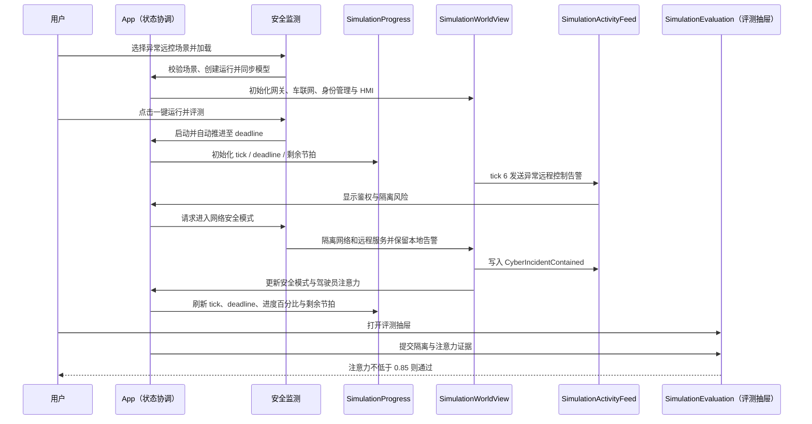

### 流程图

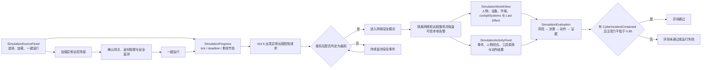

**关键处置**：进入网络安全模式（`cyberSafeModeActivate → security-monitor-1`）。

### 执行细节

- **能力解析**：`cybersecurity.enterSafeMode` 写入 `security-monitor-1` 上的 `cybersecurity.safeModeActive`、`cybersecurity.networkIsolated`、`cybersecurity.identityVerified`，以及 `connectivity.remoteServicesIsolated`、`connectivity.trustedLocalAlertActive` 共 5 个布尔标志，再写入 `driver-1.pilot.attention = 0.88`，发出 `CyberIncidentContained`（`value: 0.88`）。这是 10 个能力中写入字段最多的一条。
- **触发节奏**：`influences` 中 `security-alert-stress` 是唯一一条使用 `schedule.kind: atTick`（而非 `every`）的规则，只在 tick 6 让驾驶员压力一次性 +0.18，模拟异常远控请求的突发性；本场景 deadline 为 16 tick，是 10 个场景中最短的处置窗口。
- **评测判定**：比较 `security-monitor-1 → driver-1` 的 `CyberIncidentContained` 事件 `payload.value >= 0.85`。

## 完成一次场景后的检查

完成任一场景后，使用以下顺序确认结果：

1. 顶部状态显示 `completed`，或在异常时显示 `failed`；
2. 顶部进度已到达该场景的 deadline，或评测已提前给出完成结果；
3. Activity 中有对应的关键处置和成功事件；
4. 世界模型中的环境、人物或系统状态与该场景的处置目标一致；
5. **评测**抽屉显示运行时评测通过，并包含与该场景相符的成功证据；
6. **独立评测报告**的 scenario/run 身份与当前运行一致，发布门禁通过；如为 `INCONCLUSIVE`，先排查基础设施或持久化错误。

如果评测未通过，不要在同一运行中反复追加单步。重新加载该场景后再次执行完整流程，以便获得干净的场景初态和事件记录。历史中的旧 PASS 只能证明其所属 run，不代表当前运行通过。

**文档版本**：1.3.0（新增仿真与评测执行细节：tick 提交子步骤、能力目录 operations 写入字段、独立评测确定性判定的事件/阈值对照表，及各场景执行细节小节）
**适用范围**：Cockpit Desktop 内置 10 个标杆场景
